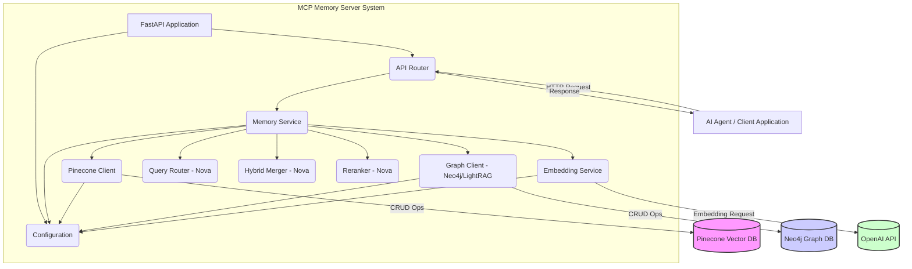
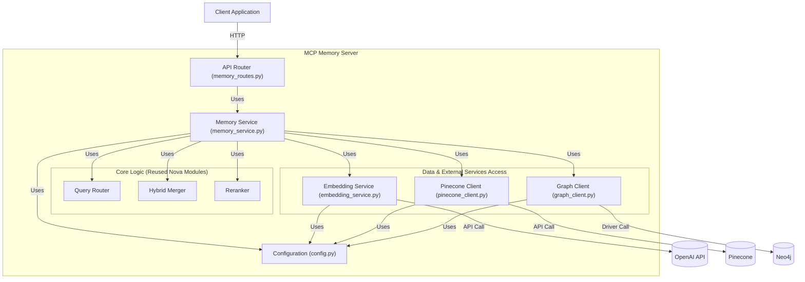
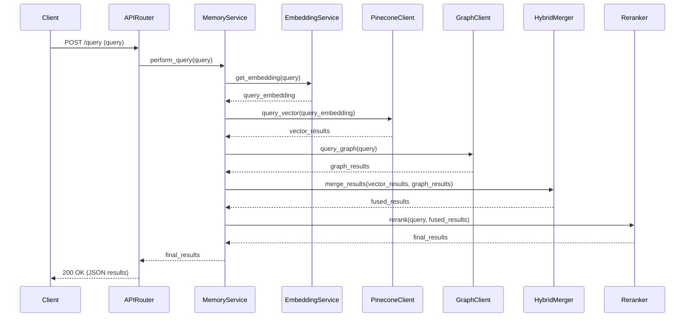
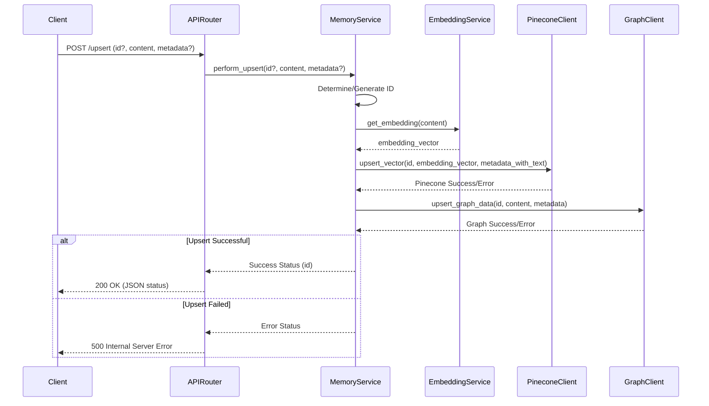

# Nova AI Memory MCP Server - Architecture Design

## 1. Introduction

### 1.1. Overview
This document outlines the architecture for the Nova AI Memory Model Context Protocol (MCP) Server. The primary goal is to create a robust, scalable, and maintainable MCP server that encapsulates Nova AI's existing sophisticated memory system. This server will provide a standardized REST API interface for AI agents and applications to interact with the fused memory capabilities, combining vector-based semantic search with knowledge graph retrieval.

### 1.2. Purpose
The purpose of this architecture is to:
- Transform Nova AI's internal memory logic into a standalone, reusable service.
- Provide a clear API adhering to MCP principles for memory `query`, `upsert`, and `delete` operations.
- Leverage existing Nova AI components (`QueryRouter`, `HybridMerger`, `CrossEncoderReranker`) to ensure functional parity.
- Utilize Pinecone for vector storage and Neo4j (via LightRAG patterns) for knowledge graph storage.
- Design for local-first development and testing, with clear paths for future cloud deployment.

### 1.3. Goals
- **Functional Parity:** Replicate the exact memory retrieval behavior of Nova AI's internal system.
- **Modularity:** Create a well-structured application with clear separation of concerns.
- **Reusability:** Package the memory system as an independent service.
- **Standardization:** Offer a RESTful API consistent with MCP concepts.
- **Maintainability:** Ensure the codebase is easy to understand, modify, and extend.
- **Deployability:** Facilitate both local development and cloud deployment scenarios.

## 2. System Context and Boundaries

The MCP Memory Server acts as an intermediary between client applications (AI Agents) and the underlying data stores (Pinecone, Neo4j) and external services (OpenAI).



**Boundaries:**
- **Clients:** Interact solely via the REST API.
- **External Services:** Pinecone, Neo4j, and OpenAI are accessed via their respective clients/APIs. The server encapsulates these interactions.
- **Nova AI Modules:** Core logic components (`QueryRouter`, `HybridMerger`, `Reranker`) are integrated internally within the `MemoryService`.

## 3. Architectural Style

- **RESTful API:** The primary interface follows REST principles, using standard HTTP methods (POST, DELETE, GET) and JSON payloads.
- **Microservice (Potential):** Designed as a standalone service, enabling independent deployment and scaling.
- **Modular Monolith (Initial):** While deployable independently, the initial implementation integrates Nova AI modules directly, resembling a modular monolith focused on the memory capability.
- **Layered Architecture:** Clear separation between API, Service, Data Access, and Core Logic layers.

## 4. High-Level Architecture (Component Diagram)



## 5. Component Design

### 5.1. FastAPI App (`app/main.py`)
- **Responsibilities:** Initializes the FastAPI application instance, includes API routers, sets up middleware (logging, CORS if needed), manages application lifecycle events (startup/shutdown for resource initialization/cleanup like DB connections).
- **Interfaces:** ASGI interface for servers like Uvicorn.

### 5.2. API Router (`app/api/memory_routes.py`)
- **Responsibilities:** Defines the REST endpoints (`/query`, `/upsert`, `/memory/{id}`, `/health`). Handles HTTP request parsing, validation using Pydantic models (`app/models.py`), and response serialization. Delegates business logic to `MemoryService`.
- **Interfaces:** HTTP endpoints. Uses `MemoryService`.

### 5.3. Memory Service (`app/services/memory_service.py`)
- **Responsibilities:** Orchestrates the core memory operations (query, upsert, delete). Integrates and uses the reused Nova AI modules (`QueryRouter`, `HybridMerger`, `Reranker`) and the data access clients (`PineconeClient`, `GraphClient`, `EmbeddingService`). Implements the fused query pipeline.
- **Interfaces:** Provides methods like `perform_query(query_text)`, `perform_upsert(id, content, metadata)`, `perform_delete(id)`. Consumes interfaces of other services/modules.

### 5.4. Pinecone Client (`app/services/pinecone_client.py`)
- **Responsibilities:** Manages connection to the Pinecone vector database. Provides methods for initializing the client, upserting vectors, querying by vector, and deleting vectors by ID. Handles Pinecone-specific API calls and configurations.
- **Interfaces:** Methods like `initialize()`, `upsert_vector(...)`, `query_vector(...)`, `delete_vector(...)`. Uses `pinecone-client` library.

### 5.5. Graph Client (`app/services/graph_client.py`)
- **Responsibilities:** Manages connection to the Neo4j graph database. Interacts with Neo4j potentially via LightRAG's `Neo4JStorage` or directly using the `neo4j` driver. Provides methods for initializing the connection, adding/updating graph data (nodes/relationships), querying the graph, and deleting graph data by ID.
- **Interfaces:** Methods like `initialize()`, `upsert_graph_data(...)`, `query_graph(...)`, `delete_graph_data(...)`. Uses `neo4j` driver and potentially `lightrag` library.

### 5.6. Embedding Service (`app/services/embedding_service.py`)
- **Responsibilities:** Generates text embeddings using the configured provider (default: OpenAI `text-embedding-ada-002`). Implements caching (e.g., LRU cache) to reduce redundant API calls and costs.
- **Interfaces:** Method like `get_embedding(text: str) -> List[float]`. Uses `openai` library.

### 5.7. Query Router (`query_router.py` - Reused)
- **Responsibilities:** Classifies incoming queries into types (VECTOR, GRAPH, HYBRID) based on learned patterns or heuristics. (Note: The API will only expose fused results, but the classification can be used internally for logging or potential optimization).
- **Interfaces:** `route(query_text) -> RoutingMode`.

### 5.8. Hybrid Merger (`hybrid_merger.py` - Reused)
- **Responsibilities:** Implements the Reciprocal Rank Fusion (RRF) algorithm to merge results from vector and graph searches. Handles deduplication of results based on content hashing.
- **Interfaces:** `merge_results(vector_results, graph_results) -> List[MergedResult]`.

### 5.9. Reranker (`reranker.py` - Reused)
- **Responsibilities:** Reranks the merged search results using a cross-encoder model (e.g., `ms-marco-MiniLM-L-6-v2`) for improved relevance based on the specific query context.
- **Interfaces:** `rerank(query, results) -> List[RerankedResult]`.

### 5.10. Configuration (`app/config.py`)
- **Responsibilities:** Loads and provides access to application settings (API keys, database URIs, model names, etc.) from environment variables or a `.env` file. Uses Pydantic's `BaseSettings` for robust loading and validation.
- **Interfaces:** Provides a settings object (e.g., `settings`) accessible by other components.

### 5.11. Models (`app/models.py`)
- **Responsibilities:** Defines Pydantic models for validating API request payloads and structuring API responses. Ensures data consistency and enables automatic API documentation generation.
- **Interfaces:** Pydantic `BaseModel` classes (e.g., `QueryRequest`, `UpsertRequest`, `MemoryItem`, `QueryResponse`).

## 6. Data Architecture

### 6.1. Data Models
- **Pinecone:**
    - **Vector ID:** Unique identifier (e.g., MD5 hash of content or client-provided ID).
    - **Values:** 1536-dimensional float vector (from OpenAI `text-embedding-ada-002`).
    - **Metadata:** JSON object containing at least `{"text": "original_content"}`. Can also include user-provided metadata (source, tags, topic, timestamp).
- **Neo4j:**
    - **Nodes:** Primarily `:Base` nodes (following Nova AI convention).
        - Properties: `id` (matching Pinecone ID), `text` (original content), `metadata` (JSON string or individual properties), potentially `embedding` (vector property).
    - **Relationships:** Could be simple links between `:Base` nodes or more structured relationships (e.g., `:WORKS_AT`, `:LOCATED_IN`) if entity/relation extraction is performed during upsert (as potentially done by LightRAG or `async_extract_and_ingest_graph_data`). Each relationship/node should ideally be traceable back to its source document/upsert via the `id`.

### 6.2. Data Flow (Query)
1.  Client sends POST `/query` with `{"query": "..."}`.
2.  API Router validates request, passes query to `MemoryService`.
3.  `MemoryService` calls `EmbeddingService` to get query embedding.
4.  `MemoryService` calls `QueryRouter` (optional logging/tuning).
5.  `MemoryService` calls `PineconeClient.query_vector()` with query embedding -> `vector_results`.
6.  `MemoryService` calls `GraphClient.query_graph()` with query text/embedding -> `graph_results`.
7.  `MemoryService` calls `HybridMerger.merge_results(vector_results, graph_results)` -> `fused_results`.
8.  `MemoryService` calls `Reranker.rerank(query, fused_results)` -> `final_results`.
9.  `MemoryService` returns `final_results` to API Router.
10. API Router serializes results into JSON response for the client.

### 6.3. Data Flow (Upsert)
1.  Client sends POST `/upsert` with `{"id": "...", "content": "...", "metadata": {...}}`.
2.  API Router validates request, passes data to `MemoryService`.
3.  `MemoryService` determines/validates `memory_id`.
4.  `MemoryService` calls `EmbeddingService.get_embedding(content)` -> `embedding_vector`.
5.  `MemoryService` calls `PineconeClient.upsert_vector(memory_id, embedding_vector, metadata_with_text)`.
6.  `MemoryService` calls `GraphClient.upsert_graph_data(memory_id, content, metadata)`. (This might involve simple node creation or more complex extraction).
7.  `MemoryService` returns success status/ID to API Router.
8.  API Router sends JSON confirmation response to the client.

### 6.4. Storage Mechanisms
- **Vector Storage:** Pinecone cloud-native vector database. Index configured for 1536 dimensions, cosine similarity.
- **Graph Storage:** Neo4j graph database (local Docker instance or cloud service like AuraDB). Schema involves `:Base` nodes and potentially extracted relationships.

## 7. API Specification

Base URL: `http://<host>:<port>`

### 7.1. `POST /query`
- **Description:** Retrieves relevant memory items based on a query string, using the fused (vector + graph) retrieval pipeline with RRF merging and cross-encoder reranking.
- **Request Body:**
  ```json
  {
    "query": "string (required)"
  }
  ```
  (Corresponds to `models.QueryRequest`)
- **Response Body (Success: 200 OK):**
  ```json
  {
    "results": [
      {
        "id": "string",
        "text": "string",
        "source": "string ('vector' or 'graph')",
        "score": "float (reranked score)",
        "metadata": "object | null"
      },
      ...
    ]
  }
  ```
  (Corresponds to `models.QueryResponse` containing a list of `models.MemoryItem`)
- **Response Body (Error):** Standard FastAPI error JSON (e.g., 422 Unprocessable Entity for invalid input, 500 Internal Server Error for processing failures).

### 7.2. `POST /upsert`
- **Description:** Adds a new memory item or updates an existing one in both Pinecone and Neo4j.
- **Request Body:**
  ```json
  {
    "id": "string (optional, server generates if missing)",
    "content": "string (required)",
    "metadata": "object (optional)"
  }
  ```
  (Corresponds to `models.UpsertRequest`)
- **Response Body (Success: 200 OK):**
  ```json
  {
    "id": "string (ID of the upserted item)",
    "status": "string ('success' or 'updated')"
  }
  ```
  (Corresponds to `models.UpsertResponse`)
- **Response Body (Error):** 422 Unprocessable Entity, 500 Internal Server Error (e.g., if DB upsert fails).

### 7.3. `DELETE /memory/{id}`
- **Description:** Deletes a memory item specified by its ID from both Pinecone and Neo4j.
- **Path Parameter:** `id` (string, required) - The unique ID of the memory item to delete.
- **Response Body (Success: 200 OK):**
  ```json
  {
    "id": "string (ID of the deleted item)",
    "status": "string ('deleted')"
  }
  ```
  (Corresponds to `models.DeleteResponse`)
- **Response Body (Error):** 404 Not Found (if ID doesn't exist, optional), 500 Internal Server Error.

### 7.4. `GET /health`
- **Description:** Checks the operational status of the server and its dependencies (Pinecone, Neo4j).
- **Response Body (Success: 200 OK):**
  ```json
  {
    "status": "ok",
    "pinecone": "ok | error: <details>",
    "neo4j": "ok | error: <details>"
  }
  ```
- **Response Body (Error: 503 Service Unavailable):** If critical dependencies are down.
  ```json
  {
    "detail": {
      "pinecone": "ok | error: <details>",
      "neo4j": "ok | error: <details>"
    }
  }
  ```

## 8. Sequence Diagrams

### 8.1. Query Sequence



### 8.2. Upsert Sequence



## 9. Deployment Architecture

### 9.1. Local Development
- **Runtime:** Python 3.9+ with virtual environment.
- **Server:** Uvicorn (`uvicorn app.main:app --reload`).
- **Databases:**
    - Pinecone: Cloud service (requires API key).
    - Neo4j: Local Docker container (managed via `docker-compose.yml`).
- **Configuration:** `.env` file loaded by `python-dotenv` / Pydantic.
- **Orchestration:** `docker-compose.yml` provided to spin up Neo4j and optionally the application container.

### 9.2. Cloud Deployment (Considerations)
- **Containerization:** `Dockerfile` provided for building a container image.
- **Hosting:** Options include PaaS (Render, Heroku, Fly.io), IaaS (AWS EC2, GCP Compute Engine), or Container Orchestration (AWS ECS/Fargate, Kubernetes).
- **Database Hosting:**
    - Pinecone: Remains cloud service.
    - Neo4j: Use managed service (Neo4j AuraDB) or host separately (Docker on VM, Kubernetes). Ensure network connectivity between app and DB.
- **Configuration:** Environment variables injected via deployment platform (e.g., Render dashboard, ECS Task Definition, K8s Secrets/ConfigMaps).
- **Scalability:** The server is designed to be stateless, allowing horizontal scaling (multiple instances behind a load balancer). Rate limits for OpenAI and performance of Neo4j/Reranker are potential bottlenecks.
- **Monitoring:** Utilize platform logging/monitoring and the `/health` endpoint.

## 10. Python-Specific Considerations

- **Framework:** FastAPI for its performance, async capabilities, automatic documentation (Swagger/ReDoc), and Pydantic integration.
- **Server:** Uvicorn as the ASGI server.
- **Asynchronicity:** Leverage `async/await` for I/O-bound operations (API calls to Pinecone, OpenAI, Neo4j driver calls if async-compatible, reranker inference).
- **Dependency Management:** `requirements.txt` listing all necessary packages (`fastapi`, `uvicorn`, `pinecone-client`, `neo4j`, `openai`, `python-dotenv`, `lightrag-hku`, sentence-transformers for reranker, etc.). Use of virtual environments (`venv`).
- **Modularity:** Python packages (`app`, `app.api`, `app.services`) and modules for separation of concerns.
- **Typing:** Use Python type hints for clarity and static analysis. Pydantic models enforce type validation at runtime for API boundaries.
- **Configuration:** Pydantic `BaseSettings` for loading environment variables and `.env` files.
- **Reused Modules:** Careful integration of existing `.py` files (`query_router.py`, etc.) ensuring correct imports and initialization.

## 11. Security

- **Credentials:** API keys and database credentials loaded securely via environment variables/`.env`, not hardcoded. `.env` file should be in `.gitignore`.
- **Authentication:** Currently designed for local/internal use. For broader access, implement API key authentication (e.g., using `FastAPI.Security` and `APIKeyHeader`) or more robust methods like OAuth2.
- **Input Validation:** Pydantic models provide basic validation against incorrect request formats. Additional validation (e.g., content length limits) can be added.
- **Dependencies:** Keep dependencies updated to patch security vulnerabilities.

## 12. Performance

- **Asynchronous Operations:** Using `async def` for routes and I/O operations prevents blocking the server.
- **Embedding Caching:** LRU cache in `EmbeddingService` reduces latency and cost for repeated embeddings.
- **Database Performance:**
    - Pinecone: Performance depends on index size and tier. Ensure appropriate pod type.
    - Neo4j: Performance depends on query complexity, data volume, and server resources. Proper indexing (e.g., on node IDs or properties used in queries) is important.
- **Reranker:** Cross-encoder reranking adds latency. The chosen model (`MiniLM`) is relatively small but can still be a bottleneck under high load, especially on CPU. Consider GPU acceleration if available/needed, or making reranking optional.
- **Connection Pooling:** Ensure database clients (Pinecone, Neo4j) reuse connections effectively (often handled by the client libraries or managed via FastAPI dependencies/startup events).

## 13. Error Handling

- **API Errors:** Use FastAPI's `HTTPException` to return appropriate HTTP status codes (4xx for client errors, 5xx for server errors) with informative JSON details.
- **Dependency Failures:** Gracefully handle exceptions during calls to Pinecone, Neo4j, or OpenAI (e.g., network errors, timeouts, API errors). Log errors and return 503 Service Unavailable if a critical dependency is down (as checked by `/health`).
- **Upsert/Delete Consistency:** Implement basic error handling for dual writes/deletes (Pinecone & Neo4j). Log inconsistencies. More robust transaction management (e.g., two-phase commit) is likely overkill but could be considered if absolute consistency is critical. Retry mechanisms for transient network errors can improve resilience.

## 14. Testing

- **Unit Tests:** Test individual components (services, utilities) in isolation, mocking dependencies (e.g., using `unittest.mock`). Test core logic like fusion and routing.
- **Integration Tests:** Test the interaction between components, potentially using test instances of databases (e.g., a local Neo4j, mock Pinecone client).
- **API Tests:** Use FastAPI's `TestClient` (based on `httpx`) to send requests to the API endpoints and verify responses, status codes, and side effects (e.g., data actually stored/deleted).
- **Coverage:** Aim for reasonable test coverage to ensure reliability.

## 15. Architectural Decision Records (ADRs) - Key Decisions

1.  **Framework Choice:** Use FastAPI due to performance, async support, Pydantic integration, and auto-documentation, aligning with modern Python web service practices.
2.  **Reuse Nova Modules:** Directly integrate `query_router.py`, `hybrid_merger.py`, `reranker.py` to ensure functional parity with Nova AI's memory system and leverage existing logic.
3.  **API Design:** Provide a simplified MCP-like interface (`/query`, `/upsert`, `/delete`) focused on fused memory operations, abstracting the internal complexity.
4.  **Data Storage:** Utilize Pinecone for scalable vector search and Neo4j for graph storage, mirroring the Nova AI stack.
5.  **Embedding Model:** Default to OpenAI `text-embedding-ada-002` for consistency with Pinecone index dimension and likely Nova AI usage. Provide embedding via a dedicated service with caching.
6.  **Configuration:** Use environment variables and `.env` files managed via Pydantic `BaseSettings` for flexibility across local and cloud environments.
7.  **Deployment Strategy:** Design for local-first development using Docker/Compose, ensuring a clear path to container-based cloud deployment.

## 16. Limitations and Future Work

- **Scalability:** While designed to be scalable, performance under very high load needs testing, especially regarding the reranker and external API limits.
- **Graph Ingestion:** The current `/upsert` assumes simple node creation or relies on potentially complex LightRAG methods. A more robust and configurable graph ingestion pipeline might be needed for complex data.
- **Error Handling:** Basic error handling is included; more sophisticated retry logic or distributed transaction management could be added for higher resilience.
- **Authentication/Authorization:** Basic API key auth suggested; production systems may require more robust security.
- **Batch Operations:** API currently handles single items; batch `/query` or `/upsert` endpoints could improve efficiency for bulk operations.
- **Monitoring:** Basic `/health` check provided; comprehensive monitoring and alerting would be needed for production.
- **Query Flexibility:** API currently offers only fused query; future versions could expose vector-only or graph-only modes if needed, potentially guided by the `QueryRouter`.